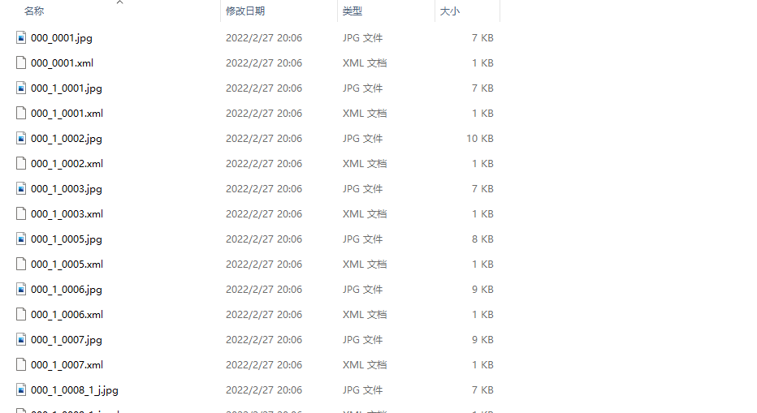

# tflite_train_custom_model
## 1. 准备数据集
创建文件夹 data  
> 包含 train 和 validation  
在两文件夹下放置照片 最好为jpg格式  

```
D:\DOCUMENT\TRAFFIC SIGN DETECT\ARCHIVE\DATA_OUTPUT
├─validation
└─train
```
  

***
> 每个文件夹下有图片和相应的xml标记文件( **一一对应!!!** )  

### 标记图片 
可自行百度搜索  --> [labelimg 的安装](https://blog.csdn.net/dulingwen/article/details/88840703)   -- > [labelimg 的使用](https://blog.gtwang.org/useful-tools/labelimg-graphical-image-annotation-tool-tutorial/)  

## 2. 接下来就是训练了 
在 colab 上打开 train_custom_model.ipynb   
定位到 load_dateset  
把自己的数据上传到colab
```
train_data = object_detector.DataLoader.from_pascal_voc(
    'android_figurine/train', // 训练图片的文件夹
    'android_figurine/train', // 标记xml文件的文件夹
    ['android', 'pig_android'] // 类别 有几个写几个 注意标签名要与标记的对应 
)

val_data = object_detector.DataLoader.from_pascal_voc(
    'android_figurine/validate',
    'android_figurine/validate',
    ['android', 'pig_android']  // 同理  
)
```

### 后面跟着笔记本的教程就可以了 把模型文件下载下来 部署到自己的树莓派上
